新卒1年目の時に書いた社内勉強用のテキストです。

# コンピュータ・グラフィックスの基礎

## デモ
<a href="https://taku689.github.io/BasicCG/.">BasicCGApp</a>

## 概要
### コンピュータ・グラフィックスとは
コンピュータグラフィックス（英語：computer graphics、略称：CG) はコンピュータを用いて作成される画像である。日本では、和製英語の「コンピュータグラフィック」または「グラフィック」も使われる。（wikiより）

### コンピュータ・グラフィックスを構成する要素
* モデリング
  * 物体の形状データを作成する
* 投影
  * カメラの位置と方向から被写体の像の形を決める
* レンダリング
  * モデリングや投影により作成されたデータから2次元ディジタル画像を生成する処理

## 目的
* CGを表現するにあたり必要な、簡単な数学を理解する
* モデリング、投影、レンダリングの基礎について理解する
* 上記の理論をそのまま実装したデモを触り、実装の面からも理解する

## 1. ベクトル・行列の基礎演算
CGの基礎を理解するのに必要な数学の公式を示す

### 2点間のベクトルの導出
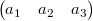 　　　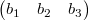

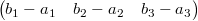

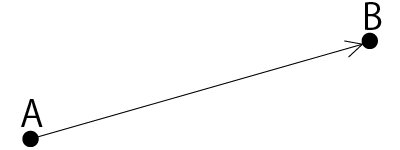

### ベクトルの内積
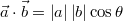

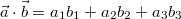

### 行列の足し算・掛け算
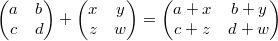

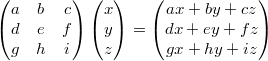

### 行列の法則
* 可換ではない

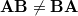

* 結合法則

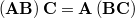


## 2. モデリング
* 表現したい物体の形状をコンピュータ内部で表現をすること
* 表現をしたデータをモデルという

### モデルの種類
* ワイヤフレームモデル
 * 稜線だけを記録することによって立体を表現したモデル
 * 頂点同士の接続関係を簡単に表現でき、データのアクセスも高速
 * どこに面があるか、どこが立体の内部であるか等の情報はない
* サーフェスモデル
 * ワイヤフレームモデルに面の情報を付加したモデル
 * 立体の外観が認識できるようになる
 * どこが物体の内部であるかの情報は持たないため、体積の計算や物体同士の集合演算はできない
* ソリッドモデル
 * サーフェスモデルのデータに物体内部の情報を持ったもの
 * 中身の詰まったモデルを表現できる

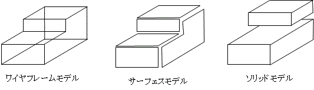

### 代表的な形状表現手法

### 境界表現（ソリッドモデル）
* 頂点、稜線、面のデータとその接続関係を保持することにより立体を表現するもの
* 稜線を曲線で表すことによって、曲面で構成された形状を表現することもできる
* 比較的単純な工業製品のデザイン等に適している
* CAD等で使われている

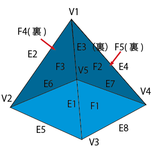

* 曲線、曲面に関する様々な表現手法が存在する
 * ファーガソン曲線
 * ベジエ曲線
 * Bスプライン曲線
 * 有理ベジエ曲線
 * NURBS曲線
 * 双3次クーンズ曲面
 * ベジエ曲面
 * Bスプライン曲面
 * 有理ベジエ曲面
 * NURBS曲面

### ポリゴン曲面の表現（サーフェスモデル）
* 数式で表現された曲面ではなく、細かいポリゴンの集合として表現された曲面
* 三角形が使われることが多い
* ゲーム等、高速に描画することが必要なものに使われている
* Unity等で使われている

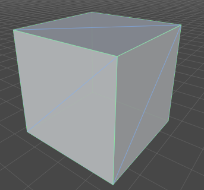

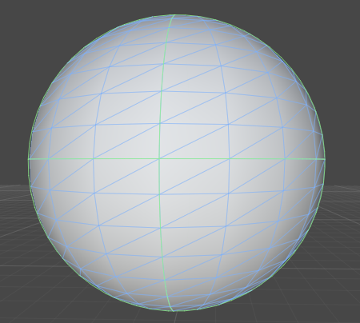

```javascript
    BasicCG.Material.Triangle = Material.extend({
          initialize: function(p1, p2, p3) {
              this.vertexes = [p1, p2, p3];
          },
```

```javascript
    BasicCG.util.Vector3D = function(x,y,z) {
            this.x = x;
            this.y = y;
            this.z = z;
    },
```

```javascript          
    BasicCG.Material.Box = Material.extend({
        initialize: function(x, y, z, w, h, d) {
            this.w = w;
            this.h = h;
            this.d = d;
            this.angle = new BasicCG.util.Vector3D(0, 0, 0);
            this.pos = new BasicCG.util.Vector3D(x, y, z);
            this.vertexes = {
                p11: new BasicCG.util.Vector3D(x - w/2, y - h/2, z - d/2),
                p12: new BasicCG.util.Vector3D(x - w/2, y + h/2, z - d/2),
                p13: new BasicCG.util.Vector3D(x + w/2, y + h/2, z - d/2),
                p14: new BasicCG.util.Vector3D(x + w/2, y - h/2, z - d/2),
                p21: new BasicCG.util.Vector3D(x - w/2, y - h/2, z + d/2),
                p22: new BasicCG.util.Vector3D(x - w/2, y + h/2, z + d/2),
                p23: new BasicCG.util.Vector3D(x + w/2, y + h/2, z + d/2),
                p24: new BasicCG.util.Vector3D(x + w/2, y - h/2, z + d/2),
            };
            var vertex = this.vertexes;
            this.triangles = [
                //正面
                new BasicCG.Material.Triangle(vertex.p11.getInstance(), vertex.p12.getInstance(), vertex.p13.getInstance()),
                new BasicCG.Material.Triangle(vertex.p13.getInstance(), vertex.p14.getInstance(), vertex.p11.getInstance()),
                //右面
                new BasicCG.Material.Triangle(vertex.p14.getInstance(), vertex.p13.getInstance(), vertex.p23.getInstance()),
                new BasicCG.Material.Triangle(vertex.p23.getInstance(), vertex.p24.getInstance(), vertex.p14.getInstance()),
                //裏面
                new BasicCG.Material.Triangle(vertex.p24.getInstance(), vertex.p23.getInstance(), vertex.p22.getInstance()),
                new BasicCG.Material.Triangle(vertex.p21.getInstance(), vertex.p24.getInstance(), vertex.p22.getInstance()),
                //左面
                new BasicCG.Material.Triangle(vertex.p21.getInstance(), vertex.p22.getInstance(), vertex.p11.getInstance()),
                new BasicCG.Material.Triangle(vertex.p12.getInstance(), vertex.p11.getInstance(), vertex.p22.getInstance()),
                //上面
                new BasicCG.Material.Triangle(vertex.p21.getInstance(), vertex.p11.getInstance(), vertex.p24.getInstance()),
                new BasicCG.Material.Triangle(vertex.p14.getInstance(), vertex.p24.getInstance(), vertex.p11.getInstance()),
                //下面
                new BasicCG.Material.Triangle(vertex.p13.getInstance(), vertex.p12.getInstance(), vertex.p23.getInstance()),
                new BasicCG.Material.Triangle(vertex.p22.getInstance(), vertex.p23.getInstance(), vertex.p12.getInstance()),
            ];
        },
```

```javascript
        draw: function() {
            if(!this.drawable) return;
            var that = this;
            var ctx = BasicCG.context;
            ctx.beginPath();
            ctx.moveTo(this.vertexes[0].x, this.vertexes[0].y);
            for (var i = 1; i < 3; i++){
                ctx.lineTo(this.vertexes[i].x, this.vertexes[i].y);
            }
            ctx.closePath();
            ctx.strokeStyle = this.getStrokeColorTxt();
            ctx.stroke();
            ctx.fillStyle = this.getColorTxt();
            ctx.fill();
        },
```

ポリゴンを用いて曲面を表現するためには多数の手法がある

#### 細分割曲面
* ポリゴンの集まりで表された形状データに単純な分割操作を再帰的に適用してなめらかな曲面を得る手法
* 細分割の操作は分割ステップと平滑化ステップの2つからなる
 * 分割ステップでは、頂点を追加し、分割のしかたを決める
 * 平滑化ステップでは、それぞれの頂点の座標値が修正される

## 3. 投影
2次元のディスプレイに3次元の図形を描画するには、3次元図形を2次元図形に変換する必要性がある。
これを投影という。

### 座標系
* 3次元の直行座標の場合、座標系はx, y, zとなる
 * 右手系と左手系で定義できる

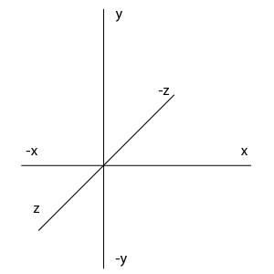


* 座標系の取り方は様々であるが、極座標、円柱座標等もある
 * 極座標
   * x = rsinθcosΦ
    * y = rsinθsinΦ
    * z = rcosθ
 * 円柱座標
   * x = ρcosΦ
    * y = ρsinΦ
    * z = z
* 様々な座標系があるが、用途に合わせた座標系を用いれば良い
 * 直交座標系 → 直観的に分かりやすい
 * 極座標系 → 微分・積分計算がしやすい場合がある
 * 円柱座標系 → 円柱の表現がしやすい

### 座標変換

#### 行列による移動
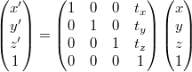

#### 行列による拡大
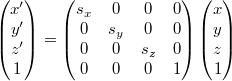


#### 回転
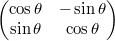

#### 行列による回転
* x軸周り

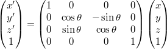

* y軸周り

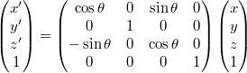

* z軸周り

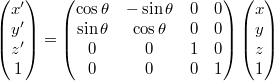


#### コード
```javascript


    BasicCG.util.Vector3D = function(x,y,z) {
            this.x = x;
            this.y = y;
            this.z = z;
    },
    BasicCG.util.Vector3D.prototype = {
        transCoordinatesPoint: function (trans_matrix) {
            var res = BasicCG.util.Matrix.mul(trans_matrix, [[this.x], [this.y], [this.z], [1]]);
            this.x = res[0][0];
            this.y = res[1][0];
            this.z = res[2][0];
        },
        //点の移動
        
        moveDistancePoint: function(x,y,z) {
            this.transCoordinatesPoint(
                [
                    [1,0,0,x],
                    [0,1,0,y],
                    [0,0,1,z],
                    [0,0,0,1]
                ]
            );
        },
        //点の拡大・縮小
        scalePoint: function (x, y, z) {
            this.transCoordinatesPoint(
                [
                    [x,0,0,0],
                    [0,y,0,0],
                    [0,0,z,0],
                    [0,0,0,1]
                ]
            );
        },
        //点のx-y平面内における回転（z軸中心の回転）
        xyRotatePoint: function (angle) {
            var theta = Math.PI * angle / 180;
            var sin = Math.sin(theta);
            var cos = Math.cos(theta);
            this.transCoordinatesPoint(
                        [
                            [cos,-sin,0,0],
                            [sin,cos,0,0],
                            [0,0,1,0],
                            [0,0,0,1]
                        ]
            );
        },
        //点のy-z平面内における回転（x軸中心の回転）
        yzRotatePoint: function (angle) {
            var theta = Math.PI * angle / 180;
            var sin = Math.sin(theta);
            var cos = Math.cos(theta);
            this.transCoordinatesPoint(
                        [
                            [1,0,0,0],
                            [0,cos,-sin,0],
                            [0,sin,cos,0],
                            [0,0,0,1]
                        ]
            );
        },
        //x-z平面内における回転（y軸中心の回転）
        xzRotatePoint: function (angle) {
            var theta = Math.PI * angle / 180;
            var sin = Math.sin(theta);
            var cos = Math.cos(theta);
                        this.transCoordinatesPoint(
                        [
                            [cos,-sin,0,0],
                            [sin,cos,0,0],
                            [0,0,1,0],
                            [0,0,0,1]
                        ]
            );
        },
        //点のy-z平面内における回転（x軸中心の回転）
        yzRotatePoint: function (angle) {
            var theta = Math.PI * angle / 180;
            var sin = Math.sin(theta);
            var cos = Math.cos(theta);
            this.transCoordinatesPoint(
                        [
                            [1,0,0,0],
                            [0,cos,-sin,0],
                            [0,sin,cos,0],
                            [0,0,0,1]
                        ]
            );
        },
        //x-z平面内における回転（y軸中心の回転）
        xzRotatePoint: function (angle) {
            var theta = Math.PI * angle / 180;
            var sin = Math.sin(theta);
            var cos = Math.cos(theta);
            this.transCoordinatesPoint(
                        [
                            [cos,0,sin,0],
                            [0,1,0,0],
                            [-sin,0,cos,0],
                            [0,0,0,1]
                        ]
            );
        },
    };
    
    BasicCG.util.Matrix = {
        //行列の掛け算
        mul: function(m1, m2){
            var res = new Array(m2.length);
            for (var i = 0; i < res.length; i++){
                res[i] = [];
            }
            var ans = 0;

            if (m1[0].length === m2.length) {
                for (var i = 0; i < m1.length; i++){
                    for (var j = 0; j < m2[0].length; j++){
                        ans = 0;
                        for (var k = 0; k < m2.length; k++){
                            ans += m1[i][k] * m2[k][j];
                        }
                        res[i][j] = ans;
                    }
                }
                return res;
            } else {
                console.log("error: cannnot mul matrix -> m1-col-length !== m2-row-length");
            }
        }
    };
```

#### 合成変換
* 変換を順に行う場合は<b>逆から</b>行列をかけていく
* 例: 移動1して回転して、また移動2したい場合
 * 変換後のベクトル:<b>a'</b>、変換前のベクトル:<b>a</b>、並行移動行列1:<b>T1</b>、回転移動行列:<b>R1</b>、平行移動行列2:<b>T2</b>とおくと
 * <b>a'</b> = <b>T2R1T1a</b>

```javascript
        rotate: function(angleX, angleY, angleZ) {
            var that = this;
            this._setAngle(angleX, angleY, angleZ);
            var currentPos = this.pos.getInstance();
            this.moveDistance(-currentPos.x, -currentPos.y, -currentPos.z);
            _.each(this.triangles, function(triangle) {
                if (angleZ !== 0) triangle.xyRotate(angleZ);
                if (angleY !== 0) triangle.xzRotate(angleY);
                if (angleX !== 0) triangle.yzRotate(angleX);
            });
            this.moveDistance(currentPos.x, currentPos.y, currentPos.z);
        },
```

* 行列の結合法則 (<b>AB</b>)<b>C</b> = <b>A</b>(<b>BC</b>)

### 投影法

#### 透視投影
* 遠くのものが小さく、近くにあるものが大きく描かれる投影法
* 写実的な表現を必要とする、映画やゲーム等に利用される

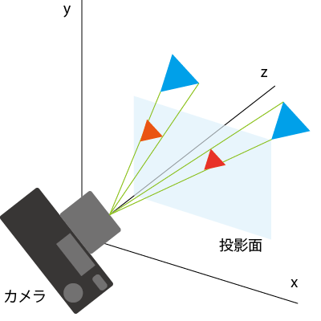
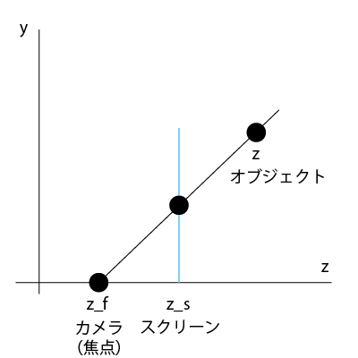

```javascript
        getPerspectiveProjection: function(vector3D, camera) {
            var screenZ = camera.screenZ;
            var projectedX =((screenZ - camera.pos.z) / (vector3D.z - camera.pos.z)) * vector3D.x;
            var projectedY =((screenZ - camera.pos.z) / (vector3D.z - camera.pos.z)) * vector3D.y;
            return new BasicCG.util.Vector3D(projectedX, projectedY, vector3D.z);
        },
```

#### 平行投影
* 遠くのものと近くのものが同じ大きさで描かれる投影法
* ものの形を正確に把握したい、設計製図やグラフの描画等に利用される

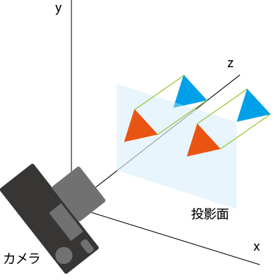

### ビューボリューム
* 実際の投影の計算では、投影面上に長方形を考え、この範囲に投影される図形のみを描く
 * この長方形をウィンドウという
 * 視点からウィンドウをカバーする角度を、画角（視野角）という
 * z軸方向に対して制限を設ける場合、視点に近いものを前方クリッピング面、遠いものを後方クリッピング面という

```javascript
_calcInViewVolume: function(camera) {
  if (this.getMinZ() > camera.minZ && this.getMaxZ() < camera.maxZ) return;
    this.drawable = false;
},
```

### ビューイングパイプライン
* 図形が定義され、変換を受けて、最終的に表示されるまでの一連の過程を、ビューイングパイプラインとよぶ

#### モデリング変換
* CG上の仮想世界では、世界の基準となるワールド座標系と呼ばれる座標系が設けられる
* モデルそれぞれの座標をモデリング座標系と呼ぶ
 * ワールド座標系で考えないのは、ワールド座標系で移動等をするごとに、形状を定義し直さなければならないため
 * 例えば、モデルを回す時に直接各ポリゴンの座標値を変えなくて良くなる
* あるモデリング座標系からワールド座標系への幾何学的変換をモデリング変換とよぶ

#### 視野変換
* ワールド座標系上でのカメラの位置と方向を表す座標系をカメラ座標系という
* ワールド座標系にあるモデルをカメラに写すためには変換が必要
* ワールド座標系からカメラ座標系への座標変換を視野変換という

#### 投影変換
* 視野変換後のカメラに移されたモデルをディスプレイに写すためには透視投影や平行投影等の、3次元座標系のものを2次元座標系に移す処理が必要で、これを投影変換という

#### ビューポート変換
* 実際に表示される画面上の座標系をデバイス座標系と呼ぶ
* また、通常はデバイス座標系内で長方形を指定し、表示画面はその長方形のみに限定される
* この長方形をビューポートといい、ビューポートに収まるような変換をビューポート変換という

#### 全体の変換
* モデリング変換を<b>M</b>、視野変換を<b>V</b>、投影変換を<b>P</b>、ビューポート変換を<b>U</b>とおく
* 全体の変換は、モデリング座標系の点<b>v</b>とすると、<b>v'</b>=<b>UPVMv</b>となる

```javascript
        getModelingTransformation: function(vector3D, camera) {
            return vector3D.getInstance();
                //TODO
        },
        getViewingTransformation: function(vector3D, camera) {
            //TODO カメラの回転
            var _vector3D = vector3D.getInstance();
            _vector3D.moveDistancePoint(-camera.pos.x, -camera.pos.y, -camera.pos.z);
            return _vector3D;
        },
        getPerspectiveProjection: function(vector3D, camera) {
            var screenZ = camera.screenZ;
            var projectedX =((screenZ - camera.pos.z) / (vector3D.z - camera.pos.z)) * vector3D.x;
            var projectedY =((screenZ - camera.pos.z) / (vector3D.z - camera.pos.z)) * vector3D.y;
            return new BasicCG.util.Vector3D(projectedX, projectedY, vector3D.z);
        },
        getViewportTransformation: function(vector3D) {
            var Conf = BasicCG.Conf;
            var _vector3D = vector3D.getInstance();
            _vector3D.moveDistancePoint(Conf.screen.width/2, Conf.screen.height/2, 0);
            return _vector3D;
        },
```

## 4. レンダリング
* 数値データとして生成されたシーンから、2次元のディジタル画像を生成する処理

### レンダリングを構成する処理

* 透視投影
 * 遠くのものが小さく、近くのものが大きく描かれる
* 隠面消去
 * 視点から見て、描かれるべきではない面を消去する
* シェーディング
 * 光源から出た光の当たった面を明るくしたり、影になる面を暗くする
 * モデルによって光が遮られた部分に影付けをする
* マッピング
 * 画像をモデル上に貼り付ける
 * 細かな凹凸や反射率等を真面目に計算するよりも、それっぽい画像を貼る方がコストが低い

### 隠面消去

#### バックフェースカリング
* 視点から不可視な面を消去すること
* 面の法線ベクトルと、視点方向へのベクトルから可視か不可視か判定できる

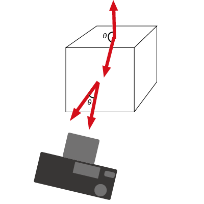

```javascript
        _isTowardCamera: function(camera) {
            var normalLine = this.getNormalLine();
            var cameraVec = new BasicCG.util.Vector3D(
                      camera.pos.x -this.vertexes[0].x,
                      camera.pos.y -this.vertexes[0].y,
                      camera.pos.z -this.vertexes[0].z
            );
            var innerProduct = normalLine.x * cameraVec.x + normalLine.y * cameraVec.y + normalLine.z * cameraVec.z;
            if (innerProduct > 0) {
                return true;
            }
            else {
                return false;
            }
        },
```

```javascript
        //面の法線ベクトル
        //現在持っている点からベクトルを2つ導出し、
        //そのベクトル2つの外積を求める
        getNormalLine: function () {
            var vec1 = new BasicCG.util.Vector3D(0, 0, 0);
            var vec2 = new BasicCG.util.Vector3D(0, 0, 0);
            var normalLine = new BasicCG.util.Vector3D(0, 0, 0); //法線ベクトル
            vec1.x = this.vertexes[1].x - this.vertexes[0].x;
            vec1.y = this.vertexes[1].y - this.vertexes[0].y;
            vec1.z = this.vertexes[1].z - this.vertexes[0].z;
            vec2.x = this.vertexes[2].x - this.vertexes[0].x;
            vec2.y = this.vertexes[2].y - this.vertexes[0].y;
            vec2.z = this.vertexes[2].z - this.vertexes[0].z;
            // 外積
            // | i    j    k |
            // |v1x  v1y  v1z|
            // |v2x  v2y  v2z|
            normalLine.x = vec1.y * vec2.z - vec1.z * vec2.y;
            normalLine.y = vec1.z * vec2.x - vec1.x * vec2.z;
            normalLine.z = vec1.x * vec2.y - vec1.y * vec2.x;

            return normalLine;
        },
```

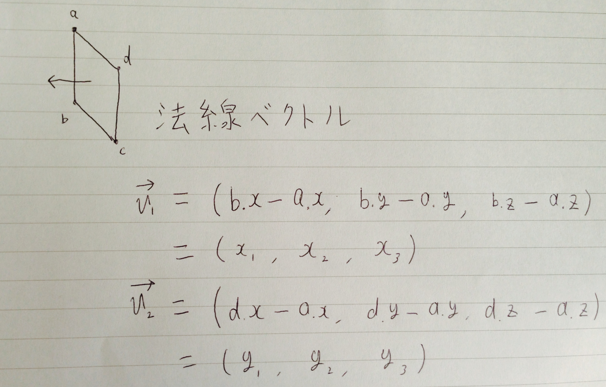
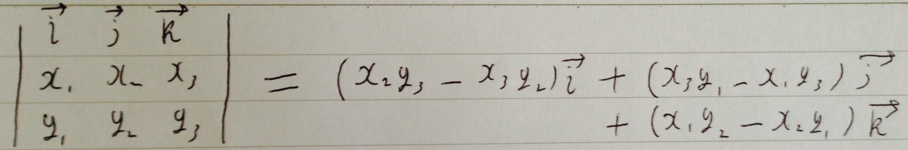
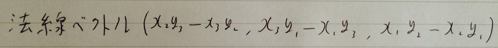

#### 隠面消去法
隠面消去アルゴリズムは、処理を行う空間により、下記の3つに分類される
##### 物体空間アルゴリズム
   * 3次元空間で隠面消去の判定を直接行う方法
   * 隠線消去を対象したものが多い

##### 画像空間アルゴリズム
* 物体が投影されるスクリーン上の走査線や画素単位で隠面消去を行う方法

##### 優先順位アルゴリズム
* 面の可視性の優先順位に基づいて隠面消去を行う方法


#### 優先順位アルゴリズム
* 面のZ値に対して奥行きソートを行い、奥にある面を先に、手前にある面を後に描く方法
  * 取られるZ値は中心、面の最奥等..

```javascript
        drawAllObjects: function() {
            var that = this;
            var ctx = BasicCG.context;
            this._drawBackGround(ctx);

            var transformedTriangles = [];
            _.each(this.objects.get(), function(object) {
                $.merge(transformedTriangles, object.getTransformedTriangles(that.camera));
            });

            transformedTriangles = this._zSort(transformedTriangles);
            _.each(transformedTriangles, function(transformedTriangle) {
                transformedTriangle.draw();
            });
            this.topView.draw(this.camera, this.objects.get());
        },

        _zSort: function(transformedTriangles) {
            return _.sortBy(transformedTriangles, function(triangle) {
                return triangle.getMaxZ();
            }).reverse();
```
  
* この方法では隠面消去に失敗する場合がある
 * 三すくみ
 * 貫通

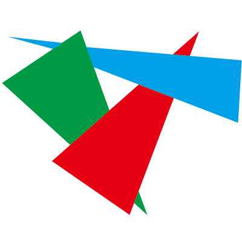
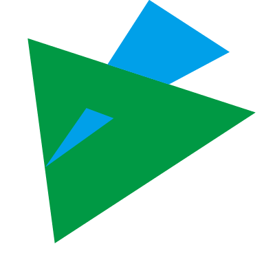

#### 画像空間アルゴリズム
* 画素ごとに判定を行うことによって、優先順位アルゴリズムの隠面消去の失敗を解決できる

##### Zバッファ法
* 各ポリゴンの画素ごとに奥行きの判定を行い、最も視点に近いポリゴンの色で画素を塗る方法

```
全ての画素を背景色で初期化する;
スクリーンのすべての画素のz値を無限大で初期化する;
すべてのポリゴンを任意の順番で取り出し、
それぞれのポリゴンについて{
 ポリゴンを透視投影する;
 ポリゴン内部の各画素の座標値を決定する;
 ポリゴン内部の各画素(x,y)について{
  スクリーンの画素（x,y)に対応する点でのポリゴンの奥行き（z値）を求める
  ポリゴンのz値とスクリーンの画素を比較して、
  ポリゴンのz値 < スクリーンの画素のz値ならば {
   スクリーンの画素(x,y)の色をポリゴンの画素(x,y)に塗る;
   スクリーンの画素(x,y)のz値をポリゴンの画素(x,y)のz値に更新する;
  }
 }
}

```

##### レイトレーシング法
* 視点からスクリーンの各画素い対してレイを飛ばし、ポリゴンに交差した場合、最も視点に近いポリゴンの色で画素を塗る方法

```
スクリーンのすべての画素を順番にとり出し
それぞれの画素について{
 視点から画素に向かうレイを決定する;
 レイとすべての物体との交差判定を行う;
 レイと交差する物体が1つ以上存在するならば{
  すべての交点のなかで最も視点に近いもの（可視点）を求める;
  その画素に可視点での物体の色を塗る;
 }
 そのほか（レイと交差する物体が存在しない）場合{
  その画素に背景色を塗る;
 }
}
```

## まとめ
コンピュータ・グラフィックスの基礎として、
* 数学の基礎
* モデリング
* 投影
* レンダリング

について発表しました。
CGについて、どのような基礎を元に表示されているのかを分かって頂けたら幸いです。

今回説明できなかったことや、更に深く知りたい場合は参考書籍を是非ご一読ください。

## 参考書籍
<a href="http://www.cgarts.or.jp/book/cg_engineer/">コンピュータ・グラフィックス</a>


